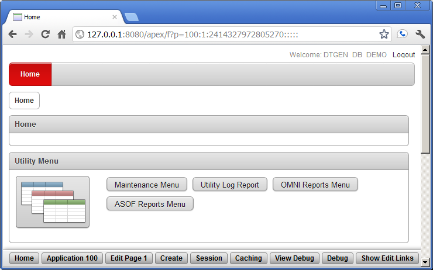
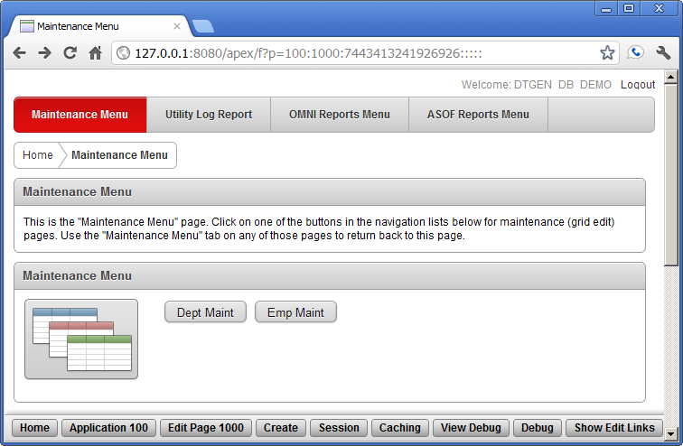
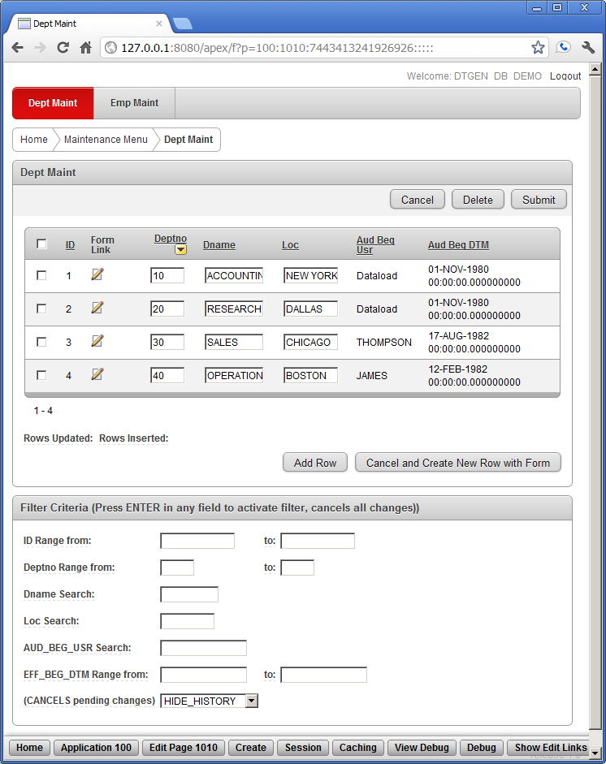
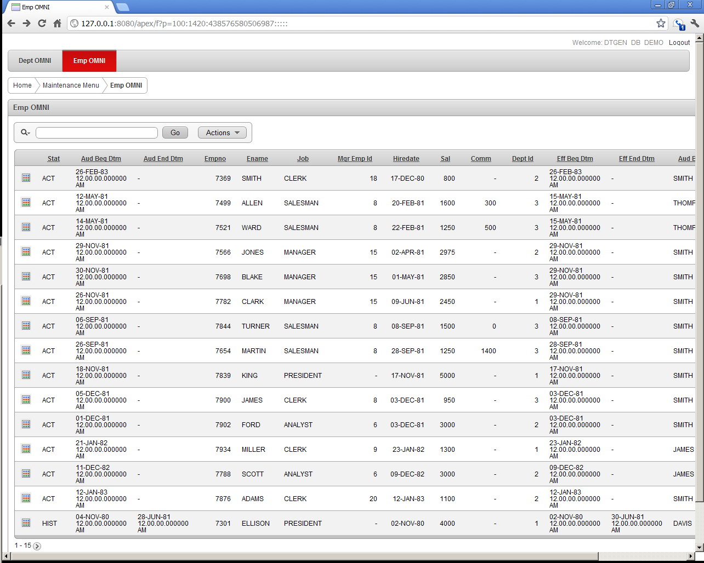

(For the top-level Wiki link, go to [WikiHome](https://github.com/DDieterich/DTGen/wiki/home))

### Oracle Database Source Code Generation Tool for Relational Designers ###

DTGen is a data driven source code generator that creates Oracle data dictionary language (DDL) scripts and Oracle Application Express (APEX) export files.  Some of the functionality available in DTGen are described in the [DTGen Functionality Wiki Page](https://github.com/DDieterich/DTGen/wiki/DTGenFunctionality).

DTGen Pre-Release 0.12 published on 10-October-2012. Download available [here](dtgen_0.12.zip).  Hardware/Software requirements for DTGen are listed at PreRelease12Compatibility.  Release Notes are available at PreRelease12ReleaseNotes

Documentation for this project is not yet complete.  However, there are 4 demonstrations available in the download that explore most of the functionality.  Unzip the archive and review the README.txt files in each directory.  Additional (unfinished) documentation is available at [WikiHome](https://github.com/DDieterich/DTGen/wiki/home).

### Basic Functionality ###

DTGen is a developers tool that reduces the man hours required to deliver basic functionality in a custom developed Oracle application.  The original project goals are described in ProjectGoals.  Highlights of the project goals are listed here:

  * Data history (audit trails, "undo", archiving, etc...)
  * Surrogate keys (very useful, but not intuitive to users)
  * Simple domain integrity (ex. "yes" or "no" without foreign key tables)
  * Multi-Tier deployment (data caching and integrity at the mid-tier)
  * Hierarchical data and paths (ex. manager to employee relationships)
  * Data maintenance forms (basic data query and modification)
  * Background logging facility (including ease of instrumentation)

The screen shots displayed below are very eye-catching. However, most of DTGen's functionality is the back-end code generated to support those Graphical User Interfaces. A quick run-through of the "Basics", "AsOf", and "Tiers" Demos included in the download will give some indication of this capability.

A more current description of DTGen functionality can be found at the [DTGen Functionality Wiki Page](https://github.com/DDieterich/DTGen/wiki/DTGenFunctionality).

### Sample Screen Shots ###

The following screen shots are generated by the GUI Demo exercise included in the Release 0.12 download.  Though GUI generation is an optional component of DTGen, these screen shots display some basic functionality provided by DTGen.

#### Default Home Page Menu ####

The screen shot below shows the "Utility Menu" APEX shared list that was generated by DTGen.  This list is shown in its default configuration, but can be configured in APEX to display as a side menu or other form placements.  This shared list is manually added to the home page the application after the DTGen generated export is imported into APEX.

#### Default Mantenance Menu Page ####

The screen shot below shows the "Maintenance Menu" screen as generated by DTGen.  The "Maintenance Menu" APEX list on this screen includes all the tables defined in the application.  Table groups are optionally defined to group these tables for an improved user experience.  The page shown is completely generated by DTGen, i.e. no manual intervention.

#### Grid Edit and Filter Page ####

The screen shot below shows the "Grid Edit and Filter" form for the DEPT table from the GUI Demo.  Each data item that is editable from every record can be modified and submitted to the database.  Also, the "Form Link" icon links to a form that displays only 1 record for easier viewing of large records.  The "Filter Criteria" region shows the column specific filtering for the DEPT table.  The "HIDE\_HISTORY" selection indicates that the history report for any record selected in the grid edit is not currently displayed. This entire form is completely generated by DTGen and ready to use when the export is imported into APEX.

#### OMNI View Page ####

The screen shot below shows the "Omni View" form for the EMP table.  This view combines all records from active, history, and pop\_audit tables into one APEX interactive report.  The search field on the report searches all columns in all tables allowing any matches to be displayed. This entire form is completely generated by DTGen and ready to use when the export is imported into APEX.

---

Thanks be to God, for He is good, and His mercy endures forever.

This project was inspired by many free utilities and information available on the internet and by the specific works of [Morten Braten](http://ora-00001.blogspot.com/)

Oracle and Java are registered trademarks of Oracle Corporation and/or its affiliates.
